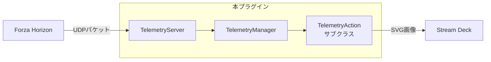

# アーキテクチャ

## アクション共通設計（ユーザーインターフェースレイヤー）

本プラグインは、Forza Horizon のテレメトリデータを受信し、Stream Deck + の液晶キー（Keypad）およびダイヤル液晶（Encoder）のハイブリッド表示に対応した5つのアクション（速度計、ラップタイム、Gフォース、タイヤ温度、サスペンション移動量）を提供します。

## 全体フロー

## 主要クラス

### [TelemetryServer](../src/telemetry/server.ts)

- **役割**: `node:dgram` の `udp4` を用いてテレメトリデータを受信するUDPサーバー。受信した生パケットは、イベントとして上位（`TelemetryManager`）へ通知する。
- **エラー制御**: エラー検知時（ポート競合等）は自動でソケットをクローズし、エラーイベントを上位へ通知する。

### [TelemetryManager](../src/telemetry/manager.ts)

- **役割**: 受信データのパースおよびアクションへの配信管理を行うシングルトンインスタンス。
- **データ解析とスロットリング**: `TelemetryServer` から生パケットを受信後、配信頻度を最大20FPS（50ms間隔）に制限しつつ、パース処理（[parser.ts](../src/telemetry/parser.ts)）でオブジェクト構造に変換してからイベントとして各アクションへブロードキャストする。
- **リソースの自動管理**: `data` イベントの購読数でアクティブなアクションの増減を監視し、ソケットの開閉を自動制御する。
  - アクションが画面に表示されたとき、`TelemetryServer` を自動起動。
  - すべてのアクションが画面から消えたとき、`TelemetryServer` を自動停止。

### [TelemetryAction](../src/actions/telemetry-action.ts)（アクションの共通ベースクラス）

- **ライフサイクル自動制御**: アクションの表示／非表示と連動して、テレメトリ受信の購読・購読解除を自動制御。
- **データキャッシュ**: 直近のテレメトリデータを保持し、画面の切り替わりや設定変更時、直近のデータで画面を再表示可能。
- **一斉再描画**: グローバル設定（フォント等）の変更時、登録済みのアクティブアクションに対して `refreshActiveActions()` を呼び出し、即時再描画を実行。
- **動的データソース**: `onSendToPlugin` で、Property Inspectorからのデータソース要求（`getFonts` イベント）をフックし、OSのローカルフォント一覧を動的に取得してUIへ配信する。

## Property Inspector（設定画面）

Stream Deck公式のUIライブラリ [sdpi-components.js](../com.github.shiguruikai.streamdeck-forza-telemetry.sdPlugin/ui/sdpi-components.js) を使用し、設定の自動同期や動的なデータソースの取得に対応する。

- **グローバル設定（[settings.ts](../src/settings/settings.ts)）**: プラグイン全体で同期される共通設定（接続ポート、IPアドレス、フォント）
  - **監視と適用**: [plugin.ts](../src/plugin.ts) にて、設定変更を一元監視し、プラグイン起動時にも設定の適用を行う。
  - **適用時のフロー**:
    1. グローバルフォント名の保存
    1. 接続ポート・IPアドレスの適用
    1. アクティブアクションの一斉再描画
- **ローカル設定**: SDKを介してアクション別に保存される設定。表示単位（KM/H <-> MPH、°C <-> °F）、表示モード（車輪位置、タイトル表示の有無）など。
