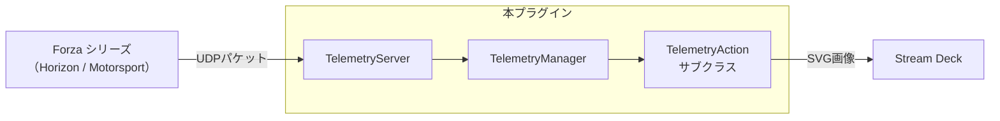

# アーキテクチャ概要

## ディレクトリ構造

```
.
├── .github/
│   └── workflows/
│       ├── ci.yml                        # CI（ビルド＆検証）
│       └── release.yml                   # GitHub Release の自動化
├── com.github.shiguruikai.streamdeck-forza-telemetry.sdPlugin/
│   ├── bin/                              # ビルド成果物の出力先
│   ├── imgs/                             # 画像リソース
│   │   ├── actions/                      # 各アクション用のアイコン画像（icon.svg と key.svg は同一データで配置）
│   │   └── plugin/                       # プラグインのアイコン画像
│   ├── layouts/                          # アクションのレイアウト定義
│   │   └── canvas-layout.json            # 全アクション共通のキャンバスレイアウト
│   ├── logs/                             # ログ出力先
│   ├── ui/                               # 各アクションのProperty Inspector（設定画面）のUI定義
│   │   ├── common.css                    # 共通スタイルシート
│   │   ├── compass.html                  # コンパス
│   │   ├── g-force.html
│   │   ├── race-info.html
│   │   ├── sdpi-components.js            # 公式のUIライブラリ
│   │   ├── speed-meter.html
│   │   ├── suspension-travel.html
│   │   └── tire-temp.html
│   └── manifest.json                     # プラグインの構成定義
├── docs/                                 # 設計・開発ドキュメント
│   ├── forza-telemetry/                  # Forza テレメトリデータ仕様書
│   │   ├── fh6.md
│   │   └── fm8.md
│   ├── marketplace/                      # Marketplace 掲載・申請用ドキュメント
│   │   ├── listing.md                    # Marketplace 掲載用説明文
│   │   └── roadmap.md                    # Marketplace リリースロードマップ
│   ├── stream-deck/                      # Stream Deck プラグイン開発ナレッジベース
│   ├── architecture.md                   # アーキテクチャ概要
│   ├── design-rules.md                   # UIデザインルール
│   └── release-guide.md                  # リリース手順書
├── src/                                  # ソースコード
│   ├── actions/                          # 各アクションの処理
│   │   ├── compass.ts                    # コンパス
│   │   ├── g-force.ts                    # Gフォースメーター
│   │   ├── press-duration.ts             # 長押し判定付きベースクラス
│   │   ├── race-info.ts                  # レース情報（ラップ・順位・タイム）
│   │   ├── speed-meter.ts                # 速度計
│   │   ├── suspension-travel.ts          # サスペンション
│   │   ├── telemetry-action.ts           # 共通ベースクラス
│   │   └── tire-temp.ts                  # タイヤ温度
│   ├── settings/                         # 設定関連
│   │   └── settings.ts                   # グローバル・ローカル設定の型定義やパース処理
│   ├── telemetry/                        # Forzaテレメトリ関連
│   │   ├── manager.ts                    # テレメトリデータの管理
│   │   ├── parser.ts                     # UDPパケットのパーサー＆データ型定義
│   │   └── server.ts                     # UDP受信サーバー
│   ├── types/                            # 型定義
│   │   └── sdpi.ts                       # SDPI（Stream Deck Property Inspector）関連の型定義
│   ├── utils/                            # 共通ユーティリティ
│   │   ├── format.ts                     # 変換系の処理
│   │   ├── graphics/                     # 動的SVGグラフィック描画モジュール群
│   │   │   ├── common.ts                 # 共通スタイル・レイアウト調整ヘルパー
│   │   │   ├── compass.ts                # コンパス描画
│   │   │   ├── g-force.ts                # Gフォース描画
│   │   │   ├── race-info.ts              # レース情報描画
│   │   │   ├── speed-meter.ts            # 速度計・ギア描画
│   │   │   ├── suspension.ts             # サスペンション描画
│   │   │   ├── tire-temp.ts              # タイヤ温度描画
│   │   │   ├── wheels.ts                 # 全輪・単輪共通描画
│   │   │   └── index.ts                  # グラフィックモジュールのバレルエクスポート
│   │   └── utils.ts                      # 汎用関数
│   └── plugin.ts                         # プラグインのエントリポイント
├── tests/                                # テストコード
│   ├── simulate-telemetry.ts             # 擬似テレメトリ送信シミュレータ
│   └── tsconfig.json                     # テスト用TypeScript設定
├── tools/                                # 開発支援ツール
│   └── gen-marketplace-icon.ps1          # プラグインのアイコン（marketplace.svg）をPNG形式に変換するスクリプト
├── .editorconfig                         # EditorConfig設定ファイル
├── .gitignore                            # Gitの除外設定
├── AGENTS.md                             # AIエージェント向けのガイド
├── CHANGELOG.md                          # 変更履歴
├── eslint.config.ts                      # ESLint設定ファイル
├── LICENSE                               # ライセンスファイル
├── package.json                          # プロジェクトの設定と依存関係
├── pnpm-lock.yaml                        # pnpmロックファイル
├── README.md                             # README.md
├── rollup.config.mjs                     # Rollupビルド設定
└── tsconfig.json                         # TypeScript設定
```

## データフロー



## 主要クラス

### [TelemetryServer](../src/telemetry/server.ts)

- **役割**: `node:dgram` の `udp4` を用いてテレメトリデータを受信するUDPサーバー。受信した生パケットは、イベントとして上位（`TelemetryManager`）へ通知する。
- **エラー制御**: ソケットのバインドエラー（ポート競合など）や受信時エラーが発生した場合、自動でソケットをクローズし、エラーイベントを上位（TelemetryManager）へ通知する。

### [TelemetryManager](../src/telemetry/manager.ts)

- **役割**: 受信データのパースおよびアクションへの配信管理を行うシングルトンインスタンス。
  - 使用する際はインスタンスを直接インポートする。例：`import { telemetryManager } from '../telemetry/manager';`
- **データ解析とスロットリング**: `TelemetryServer` から生パケットを受信後、グローバル設定のFPS（10〜30 FPS、デフォルト10 FPS）に基づいた配信間隔に動的制限（スロットリング）しつつ、パース処理（[parser.ts](../src/telemetry/parser.ts)）でオブジェクト構造に変換してからイベントとして各アクションへブロードキャストする。
  - **対応フォーマット**:
    - Forza Horizon（324バイト）
    - Forza Motorsport 7 Dash形式（311バイト）
    - Forza Motorsport 8 Dash形式（331バイト） ※Sled形式（232バイト）は未サポート。
- **リソースの自動管理**: `data` イベントの購読数でアクティブなアクションの増減を監視し、ソケットの開閉を自動制御する。
  - アクションが画面に表示されたとき、`TelemetryServer` を自動起動。
  - すべてのアクションが画面から消えたとき、`TelemetryServer` を自動停止。
- **タイムアウト監視**: UDPサーバー起動後、テレメトリデータが3秒間受信されなかった場合にタイムアウトイベントを発生させ、接続障害やゲーム未起動状態を上位（TelemetryAction）へ通知する。

### [TelemetryAction](../src/actions/telemetry-action.ts)（アクションの共通ベースクラス）

- **ライフサイクル自動制御**: アクションの表示／非表示と連動して、テレメトリ受信の購読・購読解除を自動制御。
- **データキャッシュ**: 直近のテレメトリデータを保持し、画面の切り替わりや設定変更時、直近のデータで画面を再表示可能。
- **一斉再描画**: グローバル設定（フォント等）の変更時、登録済みのアクティブアクションに対して `refreshActiveActions()` を呼び出し、即時再描画を実行。
- **動的データソース**: `onSendToPlugin` で、Property Inspectorからのデータソース要求（`getFonts` イベント）をフックし、OSのローカルフォント一覧を動的に取得してUIへ配信する。
- **エラー・タイムアウトハンドリング**: TelemetryManagerからのエラーイベント（ポート競合など）やタイムアウトイベント（3秒間データ未受信）を受信した際、現在アクティブなすべてのアクションに対してSDKの `showAlert()` を呼び出して警告を表示する。

## Property Inspector（設定画面）

Stream Deck公式のUIライブラリ [sdpi-components.js](../com.github.shiguruikai.streamdeck-forza-telemetry.sdPlugin/ui/sdpi-components.js) を使用し、設定の自動同期や動的なデータソースの取得に対応する。

- **グローバル設定（[settings.ts](../src/settings/settings.ts)）**: プラグイン全体で同期される共通設定（接続ポート、IPアドレス、フォント）
  - **監視と適用**: [plugin.ts](../src/plugin.ts) にて、設定変更を一元監視し、プラグイン起動時にも設定の適用を行う。
  - **適用時のフロー**:
    1. グローバルフォント名の保存
    1. 接続ポート・IPアドレスの適用
    1. アクティブアクションの一斉再描画
- **ローカル設定**: SDKを介してアクション別に保存される設定。表示単位（KM/H <-> MPH、°C <-> °F）、表示モード（車輪位置、タイトル表示の有無）など。
