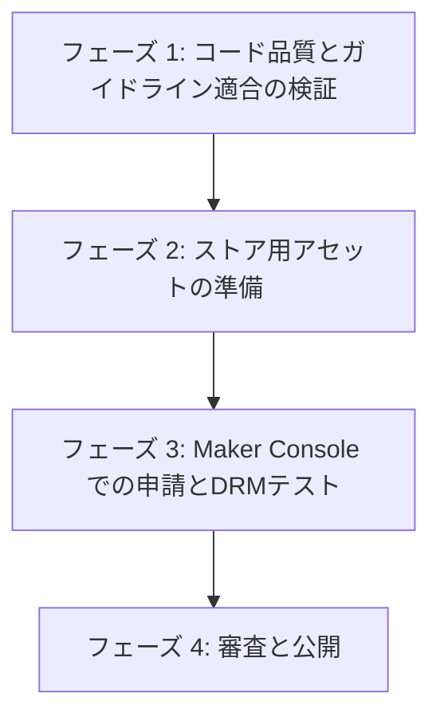

# Forza Telemetry Stream Deck プラグイン リリースロードマップ

このドキュメントは、Forza HorizonのテレメトリデータをElgato Stream Deck +に表示するプラグインを、Elgato Marketplaceに無料公開するまでのロードマップおよび進捗管理シートです。
本リポジトリの最新のコード実装状況に基づき、進捗およびタスクステータスを最新化しています。

---

## 1. リリースまでの全体フロー

---

## 2. 現在のステータス

* **Node.js SDKバージョン**: 対応済（`@elgato/streamdeck` v2以上を使用）
* **マニフェスト設定**: 対応済（`com.github.shiguruikai.streamdeck-forza-telemetry.sdPlugin/manifest.json` の `SDKVersion: 3`、および `Software.MinimumVersion: "7.1"` 設定済）
* **UUID構成**: 対応済（逆DNS形式 `com.github.shiguruikai.streamdeck-forza-telemetry` を使用）
* **検証コマンド**: 実行済（`pnpm lint:fix` による静的解析および `pnpm validate` によるマニフェスト適合テストをパス）
* **リファクタリング・状態のカプセル化（今回）**: 完了（共通ベースクラス `TelemetryAction` の導入による重複コードの削除とイベント・ライフサイクル管理の一元化、設定・テレメトリ Map キャッシュのカプセル化、`SuspensionTravelAction` の長押し機能の削除とシンプル化完了）

---

## 3. 実装済みの機能とアーキテクチャについて

現在実装されている機能仕様（速度計、ラップタイム、Gフォースメーター）および詳細なシステム設計（ライフサイクル、設定バリデーション、UDPソケット処理、リソース管理）については、以下のドキュメントに完全に分離・整理されています。

* **詳細ドキュメント**: `docs/architecture.md` を参照してください。

---

## 4. タスクリスト

### フェーズ 1: コード品質とガイドライン適合の検証（完了）
Elgatoが定めるプラグイン開発ガイドラインに準拠しているか、またコードの品質を検証します。

* [x] **静的解析の実行とフォーマット修正**
  * `eslint . --fix` にてESLintエラーおよび警告がゼロであることを確認。（コマンド： `pnpm lint:fix`）
* [x] **プラグインの構造と構成定義の検証**
  * `streamdeck validate` コマンドを使用し、`com.github.shiguruikai.streamdeck-forza-telemetry.sdPlugin/manifest.json` を含むパッケージ構成が正しいことを検証。（コマンド： `pnpm validate`）
* [x] **シミュレーターによる動作確認**
  * `tests/simulate-telemetry.ts` を実行し、擬似テレメトリデータを送信して、Stream Deck上での描画や挙動を確認。（コマンド： `pnpm sim`）
* [x] **液晶ディスプレイ（Touch Strip）の描画領域の検証**
  * すべての描画領域（`rect`）が、ガイドラインで定められた `X座標: 10〜190`、`Y座標: 5〜95` の範囲内に収まっていることを確認。
  * 対象レイアウト： `com.github.shiguruikai.streamdeck-forza-telemetry.sdPlugin/layouts/` 配下の `speed-meter-layout.json`, `lap-time-layout.json`, `g-force-layout.json`, `tire-temp-layout.json`, `suspension-travel-layout.json`

### フェーズ 2: ストア用アセットの準備（進行中）
Elgato Marketplaceでユーザーに魅力を伝えるためのアセットを作成します。

* [x] **G-Force, Tire Temperature, Suspension Travel アクション用の新規アセット作成と配置**
  * 各アクション用のアイコン（`icon.png`, `icon@2x.png`, `key.png`, `key@2x.png`）を作成して適用。
* [ ] **Marketplace用アセットの作成**
  * [ ] **アプリ（プラグイン）アイコン**： Marketplace掲載用の高解レスアイコン（プロダクトガイドライン準拠）
  * [ ] **ギャラリーアイテム（スクリーンショット／動画）**： 実際の動作の様子が伝わる動画や画像を複数枚
* [ ] **プラグイン説明文の作成**
  * Marketplaceに掲載する説明文（プラグインの特徴、対応しているForzaのバージョン、初期設定手順など）を作成。
  * 英語での説明は必須であり、日本語もあわせて準備することが推奨されます。
* [ ] **配信除外ファイル設定（.sdignore）の作成**
  * パッケージに不要なファイル（`src` ディレクトリ、`tests` ディレクトリ、設定ファイルなど）をMarketplace用パッケージから除外するため、`.sdignore` ファイルをパッケージディレクトリ内に作成。

### フェーズ 3: Maker Console での申請とDRMテスト（未着手）
開発したプラグインをアップロードし、DRM（デジタル権利管理）が有効になった状態でテストします。

* [ ] **Maker アカウントの作成**
  * [Maker Console](https://maker.elgato.com) にアクセスし、アカウントを登録またはサインイン。
* [ ] **プラグインのビルドとパッケージング**
  * リリース用ビルドを行い、パッケージングします。
  * ビルドコマンド： `pnpm build`
  * パッケージ作成コマンド： `streamdeck pack com.github.shiguruikai.streamdeck-forza-telemetry.sdPlugin`
    * ※ 出力される `.streamDeckPlugin` ファイルが配布用パッケージとなります。
* [ ] **DRM互換テスト用のアップロード（下書き保存）**
  * Maker Consoleにログインし、作成した `.streamDeckPlugin` をアップロード。
  * **※重要**: この時点では「Publish after review」（審査通過後に自動公開）のチェックを外した状態でアップロードします。
* [ ] **DRM保護版プラグインの動作検証**
  * Maker Consoleの「Versions」（バージョン）タブから、DRM処理された保護版プラグインをダウンロード。
  * 自身のStream Deck環境にインストールし、DRM保護が有効な状態で正常に動作するか（特にテレメトリデータの受信、画面描画、プロパティインスペクタの動作など）をテスト。

### フェーズ 4: 審査と公開（未着手）
テストが完了したら、審査へ提出して一般公開します。

* [ ] **審査の提出**
  * Maker Consoleで申請情報を確定し、レビューをリクエスト。
* [ ] **レビューフィードバックへの対応（必要に応じて）**
  * Elgatoレビューチームから修正要求（メタデータ、アイコン、機能面など）があった場合、修正して再提出。
* [ ] **マーケットプレイスでの公開**
  * 審査が通過したら、Marketplaceへ公開し、無料公開が完了。
* [ ] **公開後のメンテナンス体制の確認**
  * ユーザーからのフィードバックや不具合報告を受け取るための連絡先（GitHubのIssueやサポート用メールアドレスなど）を確認・用意。
