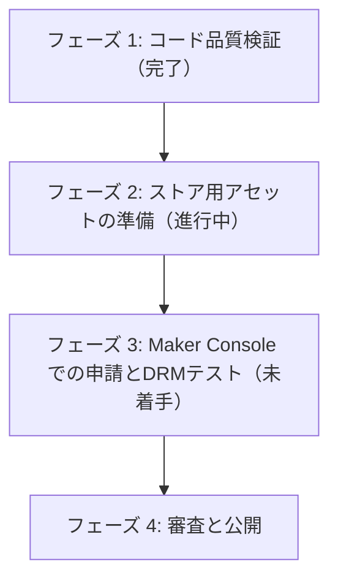

# リリースロードマップ

Elgato Marketplaceへの無料公開に向けたタスク進捗管理。

## 1. 全体フロー

## 2. タスクリスト

### フェーズ 1: コード品質とガイドライン適合の検証（完了）

- [x] ESLintエラーおよび警告ゼロの確認（`pnpm lint:fix`）
- [x] パッケージ構成およびマニフェスト適合テスト（`pnpm validate`）
- [x] 擬似テレメトリデータでの動作検証（`pnpm sim`）
- [x] タッチディスプレイ（Touch Strip）の描画領域座標がガイドライン範囲内（X:10〜190、Y:5〜95）であることの確認

### フェーズ 2: ストア用アセットの準備（進行中）

- [x] アクション用アイコンアセット（G-Force、Tire Temperature、Suspension Travel）の適用
- [ ] **Marketplace用アセットの作成**
  - アプリ・プラグインアイコン（高解像度）
  - ギャラリーアイテム（動作デモ用の動画やスクリーンショット）
- [ ] **Marketplace掲載用説明文の作成**（英語必須、日本語推奨）
- [ ] **配信除外設定ファイル（.sdignore）の作成**
  - ソースコード（src）やテスト（tests）等の不要なファイルを除外する設定

### フェーズ 3: Maker Console での申請とDRMテスト（未着手）

- [ ] Maker アカウントの作成（[Maker Console](https://maker.elgato.com)）
- [ ] 配布用パッケージ（`.streamDeckPlugin`）の作成
  - `pnpm build` 後に `streamdeck pack com.github.shiguruikai.streamdeck-forza-telemetry.sdPlugin` を実行
- [ ] DRM互換テスト用のアップロード（下書き保存、自動公開フラグはオフ）
- [ ] DRM保護版プラグイン（Maker Consoleからダウンロード）の動作検証

### フェーズ 4: 審査と公開（未着手）

- [ ] 審査の提出
- [ ] レビューフィードバックへの対応
- [ ] マーケットプレイスでの正式公開
